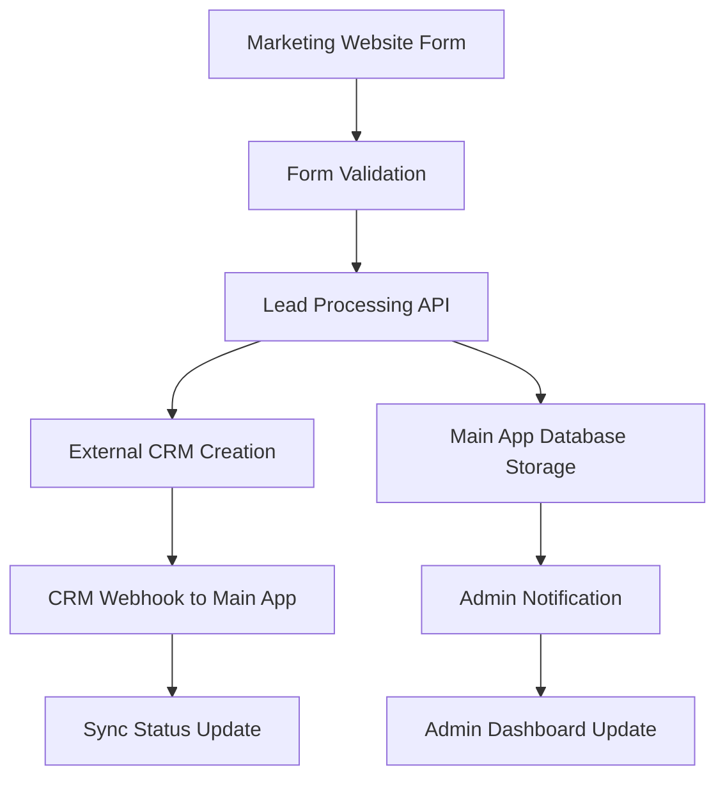
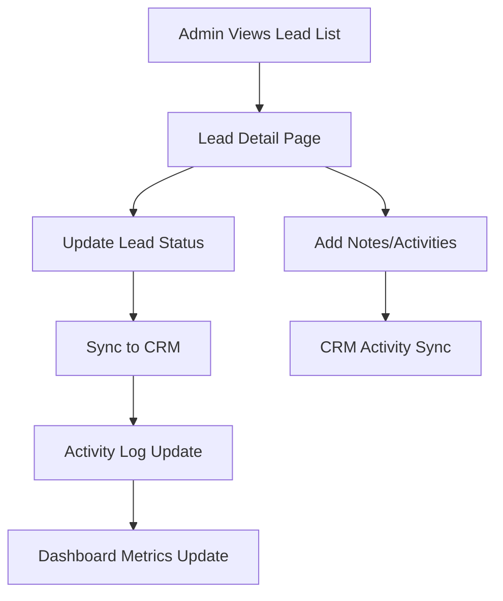

# 🔗 KHESED-TEK CRM Integration Architecture
## Marketing Website → Main Application Lead Management System

**Document Purpose**: Integration strategy for managing leads captured from the marketing website through the KHESED-TEK main application's super admin CMS system.

**Current Status**: Marketing website has lead capture → Need integration with main app CRM management

---

## 📋 Current Architecture Overview

### **Marketing Website (This Repository)**
- **Purpose**: Lead capture and customer acquisition
- **Technology**: Next.js 14, TypeScript, Railway hosting
- **Lead Sources**: Contact forms, demo requests, ROI calculator interactions
- **Current Integration**: Basic CRM adapters (HubSpot, Salesforce, Pipedrive)

### **KHESED-TEK Main Application** 
- **Purpose**: Church management system with super admin CMS
- **Technology**: [To be confirmed - likely React/Next.js based]
- **Admin System**: Built-in super admin panel with CMS capabilities
- **Target Integration**: Lead management module within existing admin interface

---

## 🎯 Integration Strategy Options

### **Option 1: Direct CRM Integration (Recommended)**
Route leads through external CRM, manage via main app admin panel.

**Architecture Flow:**
```
Marketing Website → External CRM (HubSpot/Salesforce) → Main App Admin Panel
```

**Benefits:**
- Industry-standard CRM features (automation, scoring, pipelines)
- Reliable data synchronization
- Advanced analytics and reporting
- Email marketing automation included
- Professional sales pipeline management

**Implementation Steps:**
1. Configure external CRM on marketing website
2. Build CRM API integration in main app
3. Create lead management UI in super admin panel
4. Implement real-time sync and notifications

### **Option 2: Direct Database Integration**
Send leads directly to main application database.

**Architecture Flow:**
```
Marketing Website → Main App API → Main App Database → Super Admin CMS
```

**Benefits:**
- Complete data control
- No external dependencies
- Custom lead scoring and workflows
- Integrated with existing user management

**Implementation Steps:**
1. Create lead API endpoints in main app
2. Modify marketing website to send data directly
3. Build lead management interface in admin panel
4. Implement custom workflow automation

### **Option 3: Hybrid Approach**
Use external CRM for automation, sync to main app for integrated management.

**Architecture Flow:**
```
Marketing Website → External CRM → Main App (Sync) → Super Admin CMS
```

**Benefits:**
- Best of both worlds
- CRM automation + integrated management
- Backup data storage
- Advanced analytics capabilities

---

## 🔧 Technical Implementation Details

### **1. Marketing Website Modifications Required**

#### **API Endpoint Enhancement**
```typescript
// Current: /app/api/request-demo/route.ts
// Add: Main app integration

const MAIN_APP_CONFIG = {
  apiUrl: process.env.MAIN_APP_API_URL || 'https://app.khesed-tek.com/api',
  apiKey: process.env.MAIN_APP_API_KEY,
  webhookSecret: process.env.MAIN_APP_WEBHOOK_SECRET
};

// Enhanced lead processing
async function processLead(leadData: Lead) {
  // 1. Send to external CRM (current)
  const crmResult = await sendToCRM(leadData);
  
  // 2. Send to main app (new)
  const appResult = await sendToMainApp(leadData);
  
  // 3. Handle sync conflicts and errors
  await handleSyncResults(crmResult, appResult);
}
```

#### **Required Environment Variables**
```bash
# Main App Integration
MAIN_APP_API_URL=https://app.khesed-tek.com/api
MAIN_APP_API_KEY=your_secure_api_key
MAIN_APP_WEBHOOK_SECRET=your_webhook_secret

# CRM Configuration (existing)
CRM_PROVIDER=hubspot
CRM_API_KEY=your_crm_api_key
```

### **2. Main Application Requirements**

#### **API Endpoints to Create**
```typescript
// Lead Management API
POST /api/leads/create         // Receive leads from marketing site
GET  /api/leads/list           // List all leads for admin panel
PUT  /api/leads/update/:id     // Update lead status/notes
DELETE /api/leads/delete/:id   // Archive/delete leads

// CRM Sync API
POST /api/crm/sync            // Manual sync with external CRM
GET  /api/crm/status          // Check sync status
POST /api/crm/webhook         // Receive CRM webhooks

// Admin Dashboard API
GET  /api/admin/leads/stats   // Lead statistics for dashboard
GET  /api/admin/leads/recent  // Recent leads activity
POST /api/admin/leads/bulk    // Bulk operations
```

#### **Database Schema Requirements**
```sql
-- Leads table for main application
CREATE TABLE marketing_leads (
  id UUID PRIMARY KEY DEFAULT gen_random_uuid(),
  email VARCHAR(255) NOT NULL UNIQUE,
  first_name VARCHAR(100),
  last_name VARCHAR(100),
  organization VARCHAR(255),
  phone VARCHAR(50),
  message TEXT,
  wants_demo BOOLEAN DEFAULT false,
  market VARCHAR(20), -- LATAM, USA, GLOBAL
  lead_score INTEGER DEFAULT 0,
  status VARCHAR(50) DEFAULT 'new', -- new, contacted, qualified, converted, lost
  source VARCHAR(100) DEFAULT 'website',
  utm_source VARCHAR(100),
  utm_campaign VARCHAR(100),
  utm_medium VARCHAR(100),
  external_crm_id VARCHAR(100), -- Link to CRM record
  external_crm_provider VARCHAR(50),
  created_at TIMESTAMP DEFAULT NOW(),
  updated_at TIMESTAMP DEFAULT NOW(),
  contacted_at TIMESTAMP,
  converted_at TIMESTAMP,
  assigned_to UUID REFERENCES users(id),
  notes TEXT[]
);

-- Lead activities tracking
CREATE TABLE lead_activities (
  id UUID PRIMARY KEY DEFAULT gen_random_uuid(),
  lead_id UUID REFERENCES marketing_leads(id),
  activity_type VARCHAR(50), -- form_submitted, email_opened, demo_requested, etc.
  description TEXT,
  metadata JSONB,
  created_at TIMESTAMP DEFAULT NOW(),
  created_by UUID REFERENCES users(id)
);

-- CRM sync status
CREATE TABLE crm_sync_log (
  id UUID PRIMARY KEY DEFAULT gen_random_uuid(),
  lead_id UUID REFERENCES marketing_leads(id),
  sync_direction VARCHAR(20), -- 'to_crm', 'from_crm'
  external_id VARCHAR(100),
  sync_status VARCHAR(20), -- 'success', 'failed', 'pending'
  error_message TEXT,
  synced_at TIMESTAMP DEFAULT NOW()
);
```

### **3. Super Admin CMS Integration**

#### **Lead Management Module**
```typescript
// Super Admin Lead Management Component
interface LeadManagementModule {
  // Dashboard Overview
  dashboard: {
    totalLeads: number;
    newLeads: number;
    conversionRate: string;
    recentActivity: Activity[];
  };
  
  // Lead List Management
  leadList: {
    filters: LeadFilters;
    sorting: SortOptions;
    bulkActions: BulkAction[];
    exportOptions: ExportFormat[];
  };
  
  // Individual Lead Management
  leadDetail: {
    contactInfo: LeadContact;
    activityHistory: Activity[];
    crmSyncStatus: SyncStatus;
    assignmentOptions: User[];
  };
  
  // CRM Integration Status
  crmStatus: {
    connectionStatus: boolean;
    lastSync: Date;
    syncErrors: Error[];
    manualSyncOptions: SyncAction[];
  };
}
```

#### **Admin Panel UI Components**
```jsx
// Lead Dashboard Widget
function LeadsDashboard() {
  return (
    <AdminWidget title="Marketing Leads">
      <div className="grid grid-cols-4 gap-4">
        <MetricCard title="Total Leads" value={totalLeads} />
        <MetricCard title="This Month" value={monthlyLeads} />
        <MetricCard title="Conversion Rate" value={conversionRate} />
        <MetricCard title="Avg Response Time" value={responseTime} />
      </div>
      
      <RecentLeadsTable />
      <QuickActions />
    </AdminWidget>
  );
}

// Lead Management Interface
function LeadManagement() {
  return (
    <AdminPage title="Lead Management">
      <LeadFilters />
      <LeadTable 
        leads={leads}
        onBulkAction={handleBulkAction}
        onLeadClick={openLeadDetail}
      />
      <LeadDetailModal />
    </AdminPage>
  );
}
```

---

## 🚀 Implementation Roadmap

### **Phase 1: Foundation Setup (Week 1-2)**
1. **Choose CRM Provider**
   - Evaluate HubSpot vs Salesforce vs Pipedrive
   - Consider cost, features, and integration complexity
   - Set up CRM account and API access

2. **Design Database Schema**
   - Create leads table in main application
   - Set up activity tracking tables
   - Implement CRM sync logging

3. **Create Basic API Endpoints**
   - Lead creation endpoint in main app
   - Basic CRUD operations for leads
   - Authentication and security setup

### **Phase 2: Core Integration (Week 3-4)**
1. **Modify Marketing Website**
   - Update lead processing to send to main app
   - Implement error handling and retry logic
   - Add webhook endpoints for CRM updates

2. **Build Admin Interface**
   - Create lead management pages in super admin
   - Implement lead list, detail views
   - Add basic filtering and search

3. **CRM Sync Implementation**
   - Two-way sync between main app and CRM
   - Conflict resolution strategies
   - Automated sync scheduling

### **Phase 3: Advanced Features (Week 5-6)**
1. **Workflow Automation**
   - Automated lead assignment
   - Email notifications for new leads
   - Lead scoring and prioritization

2. **Analytics and Reporting**
   - Lead source attribution
   - Conversion tracking
   - Performance dashboards

3. **Advanced Admin Features**
   - Bulk operations
   - Custom fields management
   - Export/import functionality

### **Phase 4: Testing and Optimization (Week 7-8)**
1. **Comprehensive Testing**
   - End-to-end lead flow testing
   - CRM sync reliability testing
   - Admin interface usability testing

2. **Performance Optimization**
   - Database query optimization
   - API response time improvements
   - Background job optimization

3. **Documentation and Training**
   - Admin user documentation
   - API documentation
   - Training materials for team

---

## 📊 Data Flow Architecture

### **Lead Capture Flow**


### **Lead Management Flow**


---

## 🔐 Security Considerations

### **API Security**
- **Authentication**: JWT tokens for main app API access
- **Authorization**: Role-based access control for lead management
- **Rate Limiting**: Prevent abuse of lead creation endpoints
- **Input Validation**: Sanitize all lead data before storage
- **Encryption**: Encrypt sensitive lead data at rest

### **CRM Integration Security**
- **API Key Management**: Secure storage of CRM credentials
- **Webhook Verification**: Verify CRM webhook signatures
- **Data Minimization**: Only sync necessary lead data
- **Audit Logging**: Track all CRM sync operations
- **Error Handling**: Secure error messages without data leakage

### **Admin Access Security**
- **Multi-Factor Authentication**: Required for admin panel access
- **Session Management**: Secure session handling
- **Audit Trail**: Log all admin actions on leads
- **Data Export Controls**: Restrict sensitive data exports
- **IP Restrictions**: Limit admin access to specific IPs

---

## 📈 Success Metrics and KPIs

### **Lead Generation Metrics**
- **Lead Volume**: Total leads captured per period
- **Lead Quality**: Conversion rate from lead to customer
- **Source Attribution**: Which marketing channels generate best leads
- **Response Time**: Time from lead capture to first contact
- **Conversion Funnel**: Lead → Qualified → Opportunity → Customer

### **System Performance Metrics**
- **API Response Time**: Lead creation and sync performance
- **Sync Reliability**: Success rate of CRM synchronization
- **Admin Efficiency**: Time spent managing leads in admin panel
- **Data Accuracy**: Consistency between marketing site, CRM, and main app
- **System Uptime**: Availability of lead capture and management systems

### **Business Impact Metrics**
- **Sales Pipeline Growth**: Increase in qualified opportunities
- **Revenue Attribution**: Revenue traced back to marketing leads
- **Cost per Lead**: Marketing cost divided by leads generated
- **Customer Acquisition Cost**: Total cost to acquire new customers
- **Return on Investment**: Revenue generated vs marketing spend

---

## 🛠 Technical Stack Recommendations

### **For Main Application Integration**
- **Backend Framework**: Match existing main app technology
- **Database**: PostgreSQL for lead data (if not already used)
- **API Framework**: RESTful APIs with OpenAPI documentation
- **Authentication**: JWT with refresh tokens
- **Background Jobs**: Queue system for CRM sync operations

### **CRM Provider Recommendation**
**HubSpot (Recommended for KHESED-TEK)**
- **Pros**: Free tier available, excellent API, built-in email marketing
- **Cons**: Limited customization on free tier
- **Best For**: Small to medium churches, integrated marketing

**Salesforce**
- **Pros**: Highly customizable, enterprise features, extensive ecosystem
- **Cons**: Complex setup, higher cost, steeper learning curve
- **Best For**: Large enterprises, complex sales processes

**Pipedrive**
- **Pros**: Simple interface, affordable, sales-focused
- **Cons**: Limited marketing automation, fewer integrations
- **Best For**: Simple sales tracking, budget-conscious organizations

### **Monitoring and Analytics**
- **Application Monitoring**: New Relic or DataDog
- **Error Tracking**: Sentry for error monitoring
- **Analytics**: Custom dashboard in admin panel
- **Logging**: Structured logging for debugging and compliance

---

## 💡 Additional Considerations

### **Scalability Planning**
- **Lead Volume Growth**: Plan for 10x lead volume increase
- **Geographic Expansion**: Support for multiple regions/languages
- **Feature Expansion**: Plugin architecture for new CRM providers
- **Team Growth**: Multi-admin support with role-based permissions

### **Compliance Requirements**
- **GDPR Compliance**: Data privacy for European leads
- **CCPA Compliance**: California consumer privacy act
- **Data Retention**: Policies for lead data lifecycle
- **Export/Delete**: Customer data rights management

### **Integration Maintenance**
- **CRM API Changes**: Monitor for breaking changes
- **Version Management**: Keep CRM SDK versions updated
- **Backup Strategies**: Regular backups of lead data
- **Disaster Recovery**: Plan for CRM service outages

### **Training and Documentation**
- **Admin User Guide**: How to manage leads effectively
- **API Documentation**: For future integrations
- **Troubleshooting Guide**: Common issues and solutions
- **Best Practices**: Lead management workflows

---

## 🎯 Next Steps

### **Immediate Actions Required**
1. **Confirm Main App Technology Stack**
   - Framework/platform used
   - Database system
   - Authentication method
   - Admin panel structure

2. **Choose CRM Provider**
   - Evaluate based on budget and requirements
   - Set up test account for development
   - Obtain API credentials

3. **Define Requirements Scope**
   - Essential features for MVP
   - Nice-to-have features for future
   - Timeline and resource constraints

### **Decision Points**
- **CRM Provider Selection**: HubSpot vs Salesforce vs Pipedrive
- **Integration Approach**: Direct DB vs CRM-mediated vs Hybrid
- **Feature Scope**: MVP vs full-featured implementation
- **Timeline**: Development schedule and milestones

### **Resource Requirements**
- **Development Time**: Estimated 6-8 weeks for full implementation
- **Technical Skills**: Backend API development, CRM integration experience
- **Testing Resources**: Lead capture testing, admin interface testing
- **Documentation**: Admin training and technical documentation

---

**Document Status**: Draft for Review and Decision
**Next Review**: After technology stack confirmation and CRM provider selection
**Implementation Start**: Upon approval and resource allocation

**Contact**: Development team for technical questions, business team for requirements clarification